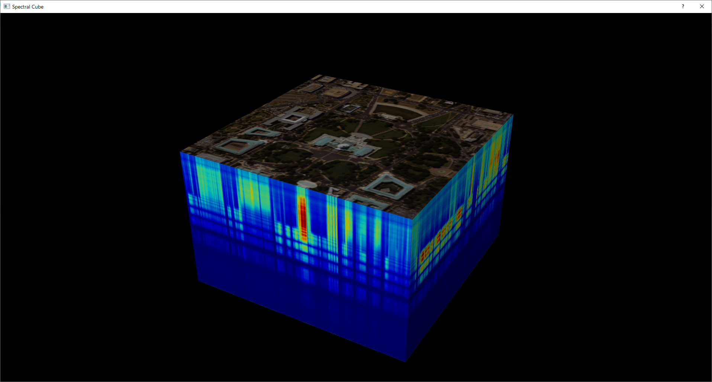

# spectralUI Prototype 
spectralUI is an open source cross platform, general purpose tool for analyzing multispectral and hyperspectral images. **This repository contains only the prototype version**. For stable version, visit [spectralUI](https://www.github.com/TomAmpiath/spectralUI)

## Screenshots
<style>
#screenshot {
    width: 100%;
    border: 2px solid #000;
}

#screenshot_div {
    width: 30%;
    float: left;
    margin: 1%;
}
</style>

<div id="screenshot_div">
<h4>Main Screen</h4>

</div>

<div id="screenshot_div">
<h4>Color Image</h4>

</div>

<div id="screenshot_div">
<h4>3D Cube</h4>

</div>

<div style="clear: both">
</div>

## Requirements

* Python 3.8.5
* OpenGL supported graphics card
* Windows / Linux / Mac OS

## Installation

Clone the repository and cd into it
```bash
git clone https://www.github.com/TomAmpiath/spectralUI_Prototype
cd spectralUI_Prototype
```

Create a virtual environment using:
```bash
python -m venv venv
```

On Windows:
```commandline
\venv\Scripts\activate
```

On Linux & Mac OS:
```bash
. ./venv/bin/activate
```

Install required packages:
```bash
pip install -r requirements.txt
```

Run the application using:
```bash
python -m spectralUI
```

## Features

* Load .mat files
* Display the spectral image in each band
* Generate sRGB color image from spectral data cube
* Display 3D spectral cube
* User's can manually enter wavelength or read it from a file
* Display metadata in a table
* Plot & Compare spectral signature at different pixel positions
* Change color maps and application theme